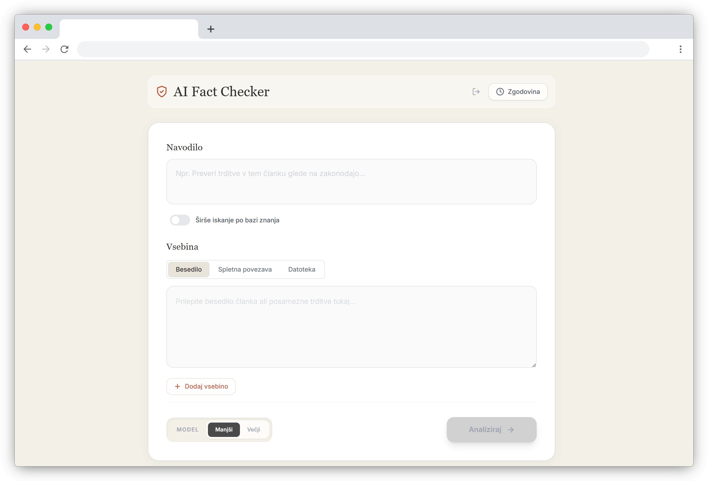

# AI Fact Checker
     

An AI-powered fact-checking application that helps verify information using Google's Gemini AI. The app analyzes text, URLs, and documents to provide fact-checking results with sources and explanations.




## Features

- **Multi-input Support**: Analyze text, URLs, and uploaded documents (PDF, text, etc.)
- **RAG Knowledge Base**: Optional retrieval-augmented generation using 100+ curated documents
- **AI-Powered Analysis**: Uses Google Gemini API for intelligent fact-checking
- **Real-time Streaming**: Get results as they are generated
- **History Management**: Save and review previous fact-checks with source citations
- **Markdown Rendering**: Rich display of analysis results
- **Authentication**: JWT-based authentication with secure HTTP-only cookies
- **Local Storage**: History persists in browser storage

## Architecture

This application uses a **client-server architecture**:

- **Frontend**: React SPA with TypeScript, communicates with backend via REST API
- **Backend**: Express.js server handling authentication and proxying Gemini API requests
- **AI Processing**: Google Gemini API accessed securely from the backend

## Tech Stack

### Frontend
- **Framework**: React 19, TypeScript 5.8, Vite 6
- **Styling**: Tailwind CSS
- **State Management**: React hooks (useState, useEffect)
- **HTTP Client**: Native fetch API

### Backend
- **Runtime**: Node.js with TypeScript
- **Framework**: Express.js 5.x
- **Authentication**: JWT with bcrypt password hashing
- **Security**: CORS, cookie-parser with httpOnly cookies
- **AI Integration**: Google GenAI SDK (@google/genai)

### External Services
- **AI**: Google Gemini API
- **URL Processing**: urltomarkdown.herokuapp.com, r.jina.ai

## Installation

### Prerequisites
- Node.js 18+
- Google Gemini API key

### 1. Clone the repository

```bash
git clone https://github.com/yourusername/ai-fact-checker.git
cd ai-fact-checker
```

### 2. Install backend dependencies

```bash
cd backend
npm install
```

### 3. Configure backend environment

Create a `.env` file in the `backend` directory:

```env
API_KEY=your_google_gemini_api_key
JWT_SECRET=your_jwt_secret_key
APP_PASSWORD=your_hashed_password
FRONTEND_URL=http://localhost:3000
PORT=4101
NODE_ENV=development
```

To generate a hashed password:
```bash
node -e "const bcrypt = require('bcrypt'); bcrypt.hash('yourpassword', 10).then(console.log)"
```

### 4. Start the backend server

```bash
npm run dev
```

The backend will run at `http://localhost:4101`.

### 5. Install frontend dependencies

```bash
cd ../frontend
npm install
```

### 6. Start the frontend development server

```bash
npm run dev
```

The app will be available at `http://localhost:3000`.

## Usage

1. **Authentication**: Enter the password to access the application.
2. **Input Selection**: Choose between Text, URL, or File input tabs. You can add multiple inputs for comprehensive analysis.
3. **RAG Toggle**: Enable "Sirse iskanje po bazi znanja" (Extended knowledge base search) to search 100+ curated documents alongside your analysis.
4. **Analysis**: Enter your content and click "Analyze" to start fact-checking.
5. **Results**: View the AI-generated analysis with sources and explanations. When RAG is enabled, retrieved sources from the knowledge base are displayed in a dedicated section.
6. **History**: Access previous analyses from the sidebar, including saved RAG sources.

## Project Structure

```
ai-fact-checker/
├── backend/                 # Express.js backend
│   ├── src/
│   │   ├── index.ts        # Main server: auth, Gemini proxy, RAG via File Search
│   │   └── types.ts        # Shared TypeScript types
│   ├── .env                # Environment variables (not in git)
│   ├── package.json
│   └── tsconfig.json
├── frontend/               # React frontend
│   ├── components/         # React components
│   │   ├── AnalysisForm/  # Input forms with RAG toggle
│   │   ├── Header/        # App header
│   │   └── ResponseDisplay/ # Results with source citations
│   ├── hooks/             # Custom React hooks
│   │   ├── useAuth.ts     # Authentication logic
│   │   ├── useStreaming.ts # SSE handling with grounding sources
│   │   └── useHistory.ts  # History management
│   ├── pages/             # Main application pages
│   ├── services/          # API integration
│   │   └── geminiService.ts # Backend API calls with RAG support
│   ├── types.ts           # TypeScript type definitions
│   ├── .env.local         # Frontend environment variables
│   └── package.json
└── rag-setup/             # RAG knowledge base configuration
    ├── setup.ipynb        # Jupyter notebook for document upload
    └── sources/           # 100+ curated documents (PDF, DOCX, MD)
```

## API Endpoints

### Authentication
- `POST /api/login` - Authenticate with password, sets JWT cookie
- `GET /api/verify` - Verify current authentication status
- `POST /api/logout` - Clear authentication cookie

### Analysis
- `POST /api/analyze` - Stream Gemini analysis (requires authentication)
  - Request body: `{ model: string, parts: Part[], useRag?: boolean }`
  - Response: Server-sent events (SSE) stream with optional grounding sources
  - When `useRag: true`, the File Search tool queries the knowledge base and returns retrieved sources in the response metadata

## Build Commands

### Backend
```bash
cd backend
npm run dev      # Development with hot reload (tsx watch)
npm run build    # Compile TypeScript to dist/
npm start        # Run compiled JavaScript
```

### Frontend
```bash
cd frontend
npm run dev      # Development server (port 3000)
npm run build    # Production build to dist/
npm run preview  # Preview production build
```

## Environment Variables

### Backend (.env)
| Variable | Description |
|----------|-------------|
| `API_KEY` | Google Gemini API key |
| `JWT_SECRET` | Secret key for JWT signing |
| `APP_PASSWORD` | Bcrypt-hashed application password |
| `FILE_SEARCH_STORE_ID` | Google File Search Store ID for RAG knowledge base |
| `FRONTEND_URL` | Allowed CORS origin |
| `PORT` | Server port (default: 4101) |
| `NODE_ENV` | Environment mode (development/production) |

### Frontend (.env.production)
| Variable | Description |
|----------|-------------|
| `API_URL` | Backend API URL (e.g., http://localhost:4101/api) |


## License

This project is the intellectual property of Tim Kmecl. All rights reserved. Unauthorized use, reproduction, or distribution of this code is strictly prohibited. For inquiries or permissions, please contact Tim Kmecl directly.


